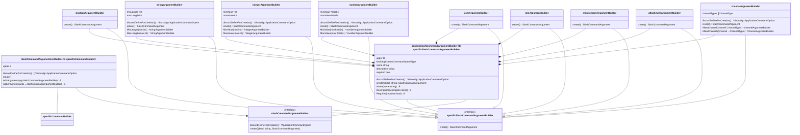

```mermaid
classDiagram

class slashCommandArgumentListBuilder~B specificCommandBuilder~ {
    upper     B
    discordDefineForCreation() []*discordgo.ApplicationCommandOption
    create()
    AddArgument(arg slashCommandArgumentBuilder) B
    AddArguments(args ...slashCommandArgumentBuilder) B
}
slashCommandArgumentListBuilder -- specificCommandBuilder
slashCommandArgumentListBuilder --* "*" slashCommandArgumentBuilder

class slashCommandArgumentBuilder {
    <<interface>>
    discordDefineForCreation() *ApplicationCommandOption
	create() (bool, string, SlashCommandArgument)
}

class specificSlashCommandArgumentBuilder {
    <<interface>>
    create() SlashCommandArgument
}

class genericSlashCommandArgumentBuilder~B specificSlashCommandArgumentBuilder~ {
	upper       B
	kind        ApplicationCommandOptionType
	name        string
	description string
	required    bool
    discordDefineForCreation() *discordgo.ApplicationCommandOption
    create() (bool, string, SlashCommandArgument)
    Name(name string) B
    Description(description string) B
    Required(required bool) B
}
genericSlashCommandArgumentBuilder -- specificSlashCommandArgumentBuilder
genericSlashCommandArgumentBuilder --|> slashCommandArgumentBuilder

class booleanArgumentBuilder {
    create() SlashCommandArgument
}
booleanArgumentBuilder --* genericSlashCommandArgumentBuilder
booleanArgumentBuilder --|> specificSlashCommandArgumentBuilder

class stringArgumentBuilder {
    minLength *int
	maxLength int
    discordDefineForCreation() *discordgo.ApplicationCommandOption
    create() SlashCommandArgument
    MinLength(min int) *stringArgumentBuilder
    MaxLength(max int) *stringArgumentBuilder
}
stringArgumentBuilder --* genericSlashCommandArgumentBuilder
stringArgumentBuilder --|> specificSlashCommandArgumentBuilder

class integerArgumentBuilder {
	minValue *int
	maxValue int
    discordDefineForCreation() *discordgo.ApplicationCommandOption
    create() SlashCommandArgument
    MinValue(min int) *integerArgumentBuilder
    MaxValue(max int) *integerArgumentBuilder
}
integerArgumentBuilder --* genericSlashCommandArgumentBuilder
integerArgumentBuilder --|> specificSlashCommandArgumentBuilder

class numberArgumentBuilder {
	minValue *float64
	maxValue float64
    discordDefineForCreation() *discordgo.ApplicationCommandOption
    create() SlashCommandArgument
    MinValue(min float64) *numberArgumentBuilder
    MaxValue(max float64) *numberArgumentBuilder
}
numberArgumentBuilder --* genericSlashCommandArgumentBuilder
numberArgumentBuilder --|> specificSlashCommandArgumentBuilder

class userArgumentBuilder {
    create() SlashCommandArgument
}
userArgumentBuilder --* genericSlashCommandArgumentBuilder
userArgumentBuilder --|> specificSlashCommandArgumentBuilder

class roleArgumentBuilder {
    create() SlashCommandArgument
}
roleArgumentBuilder --* genericSlashCommandArgumentBuilder
roleArgumentBuilder --|> specificSlashCommandArgumentBuilder

class mentionableArgumentBuilder {
    create() SlashCommandArgument
}
mentionableArgumentBuilder --* genericSlashCommandArgumentBuilder
mentionableArgumentBuilder --|> specificSlashCommandArgumentBuilder

class attachmentArgumentBuilder {
    create() SlashCommandArgument
}
attachmentArgumentBuilder --* genericSlashCommandArgumentBuilder
attachmentArgumentBuilder --|> specificSlashCommandArgumentBuilder

class channelArgumentBuilder {
    channelTypes []ChannelType
    discordDefineForCreation() *discordgo.ApplicationCommandOption
    create() SlashCommandArgument
    AllowChannel(channel ChannelType) *channelArgumentBuilder
    AllowChannels(channel ...ChannelType) *channelArgumentBuilder
}
channelArgumentBuilder --* genericSlashCommandArgumentBuilder
channelArgumentBuilder --|> specificSlashCommandArgumentBuilder
```
