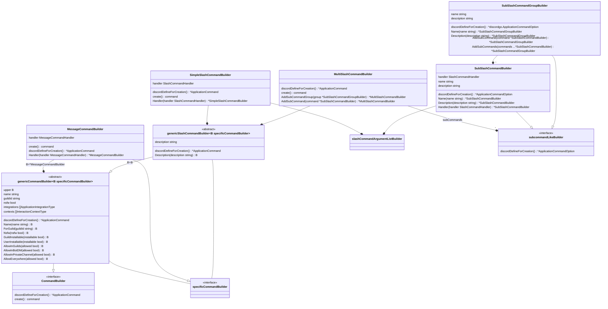

# Builders diagram

```mermaid
classDiagram

class CommandBuilder {
    <<interface>>
    discordDefineForCreation() *ApplicationCommand
    create() command
}

class specificCommandBuilder {
    <<interface>>
}

class genericCommandBuilder~B specificCommandBuilder~ {
    <<abstract>>
    upper        B
    name         string
    guildId      string
    nsfw         bool
    integrations []ApplicationIntegrationType
    contexts     []InteractionContextType
    discordDefineForCreation() *ApplicationCommand
    Name(name string) B
    ForGuild(guildId string) B
    Nsfw(nsfw bool) B
    GuildInstallable(installable bool) B
    UserInstallable(installable bool) B
    AllowInGuilds(allowed bool) B
    AllowInBotDM(allowed bool) B
    AllowInPrivateChannel(allowed bool) B
    AllowEverywhere(allowed bool) B
}
genericCommandBuilder --|> CommandBuilder
genericCommandBuilder -- specificCommandBuilder

class MessageCommandBuilder {
    handler MessageCommandHandler
    create() command
    discordDefineForCreation() *ApplicationCommand
    Handler(handler MessageCommandHandler) *MessageCommandBuilder
}
MessageCommandBuilder --|> specificCommandBuilder
MessageCommandBuilder --* genericCommandBuilder: B=*MessageCommandBuilder

class genericSlashCommandBuilder~B specificCommandBuilder~ {
    <<abstract>>
    description string
    discordDefineForCreation() *ApplicationCommand
    Description(description string) B
}
genericSlashCommandBuilder --|> genericCommandBuilder: B=B
genericSlashCommandBuilder -- specificCommandBuilder

class SimpleSlashCommandBuilder {
    handler SlashCommandHandler
    discordDefineForCreation() *ApplicationCommand
    create() command
    Handler(handler SlashCommandHandler) *SimpleSlashCommandBuilder
}
SimpleSlashCommandBuilder --* genericSlashCommandBuilder
SimpleSlashCommandBuilder --* slashCommandArgumentListBuilder

class subcommandLikeBuilder {
    <<interface>>
    discordDefineForCreation() *ApplicationCommandOption
}

class MultiSlashCommandBuilder {
    discordDefineForCreation() *ApplicationCommand
    create() command
    AddSubCommandGroup(group *SubSlashCommandGroupBuilder) *MultiSlashCommandBuilder
    AddSubCommand(command *SubSlashCommandBuilder) *MultiSlashCommandBuilder
}

MultiSlashCommandBuilder --* genericSlashCommandBuilder
MultiSlashCommandBuilder --* "*" subcommandLikeBuilder: subCommands

class SubSlashCommandBuilder {
    handler     SlashCommandHandler
	name        string
	description string
    discordDefineForCreation() *ApplicationCommandOption
    Name(name string) *SubSlashCommandBuilder
    Description(description string) *SubSlashCommandBuilder
    Handler(handler SlashCommandHandler) *SubSlashCommandBuilder
}
SubSlashCommandBuilder --|> subcommandLikeBuilder
SubSlashCommandBuilder --* slashCommandArgumentListBuilder

class SubSlashCommandGroupBuilder {
	name        string
	description string
    discordDefineForCreation() *discordgo.ApplicationCommandOption
    Name(name string) *SubSlashCommandGroupBuilder
    Description(description string) *SubSlashCommandGroupBuilder
    AddSubCommand(command *SubSlashCommandBuilder) *SubSlashCommandGroupBuilder
    AddSubCommands(commands ...*SubSlashCommandBuilder) *SubSlashCommandGroupBuilder
}
SubSlashCommandGroupBuilder --|> subcommandLikeBuilder
SubSlashCommandGroupBuilder --* "*" SubSlashCommandBuilder
```
