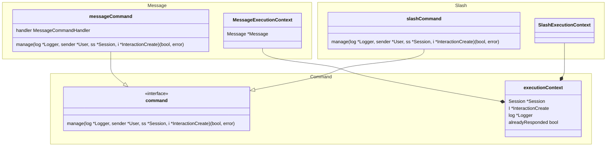

# Handlers diagram

```mermaid
classDiagram

namespace Command {

    class command {
        <<interface>>
        manage(log *Logger, sender *User, ss *Session, i *InteractionCreate) (bool, error)
    }

    class executionContext {
        Session          *Session
        I                *InteractionCreate
        log              *Logger
        alreadyResponded bool
    }

}


namespace Message {

    class messageCommand {
        handler MessageCommandHandler
        manage(log *Logger, sender *User, ss *Session, i *InteractionCreate) (bool, error)
    }

    class MessageExecutionContext {
        Message *Message
    }

}

messageCommand --|> command
MessageExecutionContext --* executionContext

namespace Slash {
    class slashCommand {
        manage(log *Logger, sender *User, ss *Session, i *InteractionCreate) (bool, error)
    }

    class SlashExecutionContext
}

slashCommand --|> command
SlashExecutionContext --* executionContext
```
