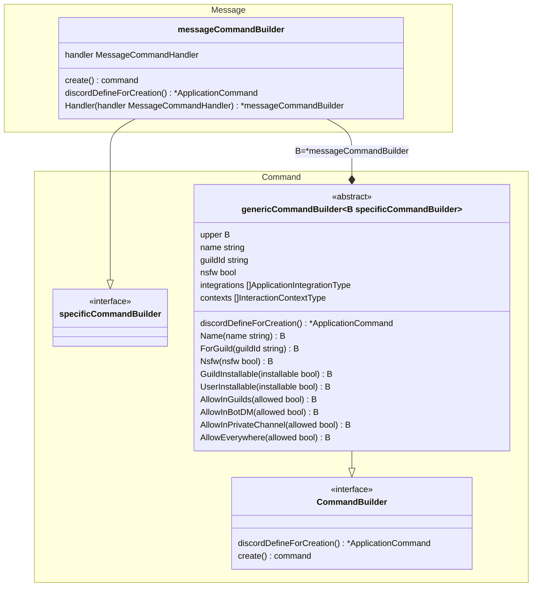

# Builders diagram

```mermaid
classDiagram

namespace Command {

    class CommandBuilder {
        <<interface>>
        discordDefineForCreation() *ApplicationCommand
        create() command
    }

    class specificCommandBuilder {
        <<interface>>
    }

    class genericCommandBuilder~B specificCommandBuilder~ {
        <<abstract>>
        upper        B
        name         string
        guildId      string
        nsfw         bool
        integrations []ApplicationIntegrationType
        contexts     []InteractionContextType
        discordDefineForCreation() *ApplicationCommand
        Name(name string) B
        ForGuild(guildId string) B
        Nsfw(nsfw bool) B
        GuildInstallable(installable bool) B
        UserInstallable(installable bool) B
        AllowInGuilds(allowed bool) B
        AllowInBotDM(allowed bool) B
        AllowInPrivateChannel(allowed bool) B
        AllowEverywhere(allowed bool) B
    }

}

genericCommandBuilder --|> CommandBuilder

namespace Message {

    class messageCommandBuilder {
        handler MessageCommandHandler
        create() command
        discordDefineForCreation() *ApplicationCommand
        Handler(handler MessageCommandHandler) *messageCommandBuilder
    }

}
messageCommandBuilder --|> specificCommandBuilder
messageCommandBuilder --* genericCommandBuilder: B=*messageCommandBuilder
```
